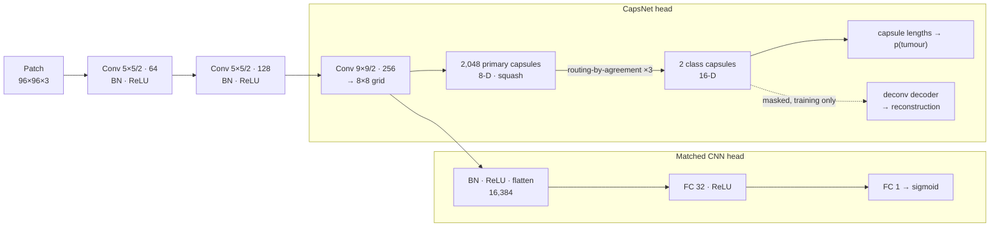

# Capsule Networks vs. CNNs for Breast Cancer Metastasis Detection

**A controlled, reproducible comparison on PatchCamelyon (PCam) lymph node histopathology — in PyTorch**

Deciding whether breast cancer has spread to the lymph nodes is one of the most important factors in staging it, and pathologists make that call by searching gigapixel slides for small clusters of tumour cells. This project asks whether **capsule networks** (Sabour, Frosst & Hinton, 2017) live up to their two headline promises on that task: **better data efficiency** and **more robustness to viewpoint changes** than ordinary convolutional networks.

We train a dynamic-routing CapsNet and two CNN baselines on 1% to 100% of the 144,000 PCam training patches (3 seeds each, 63 runs including ablations). Every model is scored once on a held-out test set and then re-scored under rotation, zoom, blur and H&E stain shifts.

---

## Contents

- [Background](#background)
- [Research questions](#research-questions)
- [Dataset](#dataset)
- [Models](#models)
- [Tech stack](#tech-stack)
- [Project history](#project-history)
- [Authors](#authors)
- [References](#references)

---

## Background

**The clinical problem.** Metastases in the sentinel lymph nodes decide the stage, and therefore the treatment, of breast cancer. Detecting them means scanning whole-slide images of H&E-stained tissue at high magnification. The work is slow and error-prone, and small metastases are easy to miss. The CAMELYON16 challenge showed that deep learning can match pathologists on this task [3]. PCam [2] turns the problem into a benchmark: classify a 96×96 px patch as containing tumour tissue or not.

**Why capsules?** A CNN detects features with convolutions and then discards *where* they are through pooling. That makes it translation-invariant, but it cannot represent spatial relationships between parts. A capsule outputs a **vector** instead of a scalar. The vector's length is the probability that an entity is present, and its orientation encodes the entity's pose. Higher-level capsules are activated by **routing-by-agreement**: lower-level capsules vote for their parents, and parents whose votes agree get stronger connections. The original paper argues that this makes capsules more data-efficient and better at generalising to new viewpoints. Histopathology is a natural test case. Diagnosis depends on how cells and nuclei are arranged, and tissue has no canonical orientation.

## Research questions

| | Question | How it is measured |
|---|---|---|
| **RQ1** | *Data efficiency*: do capsules need less labelled data? | Test ROC-AUC with 1%, 10%, 20%, 30% and 100% of the training set |
| **RQ2** | *Robustness*: do capsules generalise better to shifts not seen in training? | Test ROC-AUC under rotations by non-right angles, zoom, blur and H&E stain jitter |
| **RQ3** | *Cost*: what does routing cost in compute? | Training and inference throughput at equal parameter count |
| **RQ4** | *Ablation*: which parts of the CapsNet matter? | CapsNet without routing, and without the reconstruction decoder |

## Dataset

[**PatchCamelyon (PCam)**](https://github.com/basveeling/pcam) [2] contains 96×96 px RGB patches extracted from the 400 H&E-stained whole-slide images of sentinel lymph node sections in CAMELYON16 [3]. The slides were scanned at 40× and the patches are sampled at 10×. **A patch is positive if its centre 32×32 px region contains at least one pixel of metastatic tumour tissue.** This project uses the de-duplicated version distributed through the [Kaggle Histopathologic Cancer Detection](https://www.kaggle.com/c/histopathologic-cancer-detection) competition, arranged as a balanced 144,000 / 16,000 train/validation split:

| Split | Patches | Used for |
|---|---:|---|
| `train` | 144,000 (50% tumour) | training. Stratified subsets of 1–100%, nested per seed (the 10% subset ⊂ the 20% subset ⊂ …) |
| `valid`, first half | 8,000 (50% tumour) | checkpoint selection (validation ROC-AUC, 55 checks per run) |
| `valid`, second half | 8,000 (50% tumour) | **held-out test set**, evaluated once per run |
| `test` (unlabelled) | 57,458 | Kaggle submission via `capsnet_pcam.predict` |

## Models

All three models output a tumour probability for a 96×96×3 patch. The **matched CNN** is the key control. It shares the CapsNet's convolutional trunk layer for layer, and its fully connected head has exactly as many weights as the capsule layer (16,384 × 32 = 2,048 × 8 × 2 × 16 = 524,288). The only difference between the two models is therefore *capsules + routing* versus *a standard classifier head*, not network size.

| Model | Architecture | Parameters |
|---|---|---:|
| **Simple CNN** | Lightweight baseline from the project's first version: 3 × (conv 3×3 → ReLU → max-pool 4×4) → FC 64 → FC 1 | 60,545 |
| **Matched CNN** | Shared trunk → conv 9×9/2 (256) → BN → ReLU → flatten (16,384) → FC 32 → FC 1 | 3,389,057 |
| **CapsNet** | Shared trunk → 2,048 primary capsules (8-D) → 3 routing iterations → 2 class capsules (16-D); deconvolutional reconstruction decoder during training | 3,388,736 (+324,979 decoder) |

**Adapting CapsNet to 96×96 RGB patches.** On MNIST, the original CapsNet puts a 9×9 convolution and the 9×9/2 primary-capsule convolution directly on the 28×28 image, which gives 1,152 primary capsules. On a 96×96 patch the same design yields **51,200** primary capsules and a 28M-parameter fully connected decoder. This is what made the first, TensorFlow version of this project too expensive to train on the full dataset (see [Project history](#project-history)). Here, two strided 5×5 convolutions first reduce the patch to 24×24. That brings the count down to 2,048 capsules on an 8×8 grid, and a transposed-convolution decoder replaces the 28M-parameter FC decoder. Routing runs in float32 with gradients through the final iteration only (the other iterations only set the coupling coefficients), and the margin loss uses the paper's m⁺ = 0.9, m⁻ = 0.1, λ = 0.5.

## Tech stack

**Python** · **PyTorch** (CUDA, bf16 mixed precision, channels-last) · NumPy · pandas · scikit-learn · Matplotlib · Pillow · pytest · ruff · GitHub Actions

**Topics:** deep learning, computer vision, medical image analysis, computational pathology, capsule networks, convolutional neural networks, experimental design, ablation studies, robustness and distribution-shift evaluation, reproducible ML

## Project history

The first version of this project was written in TensorFlow/Keras, with the capsule layers adapted from [XifengGuo/CapsNet-Keras](https://github.com/XifengGuo/CapsNet-Keras). It compared a CapsNet with a small CNN on 10%, 20% and 30% of the data, because the unmodified CapsNet (51,200 primary capsules) was too slow to train on more.

The current version is a complete re-implementation in PyTorch. It adds:

- a CapsNet architecture that is tractable at 96×96 px;
- a parameter-matched CNN control;
- the full training set and a 1% regime;
- multiple seeds and a held-out test split;
- robustness and ablation studies;
- GPU-resident data loading, tests and CI.

## Authors

- **Vlad A. Nicolescu** ([@vladnicodev](https://github.com/vladnicodev))
- **Vlad Barbulescu** ([@vladaunski](https://github.com/vladaunski))
- **Andrei Pavel** ([@gunbreaker17](https://github.com/gunbreaker17))

## References

1. S. Sabour, N. Frosst, G. E. Hinton. [Dynamic Routing Between Capsules](https://arxiv.org/abs/1710.09829). *NeurIPS*, 2017.
2. B. S. Veeling, J. Linmans, J. Winkens, T. Cohen, M. Welling. [Rotation Equivariant CNNs for Digital Pathology](https://arxiv.org/abs/1806.03962). *MICCAI*, 2018.
3. B. Ehteshami Bejnordi et al. [Diagnostic Assessment of Deep Learning Algorithms for Detection of Lymph Node Metastases in Women With Breast Cancer](https://jamanetwork.com/journals/jama/fullarticle/2665774). *JAMA* 318(22), 2017.
4. D. Tellez et al. [Quantifying the effects of data augmentation and stain color normalization in convolutional neural networks for computational pathology](https://arxiv.org/abs/1902.06543). *Medical Image Analysis* 58, 2019.
5. A. C. Ruifrok, D. A. Johnston. Quantification of histochemical staining by color deconvolution. *Analytical and Quantitative Cytology and Histology* 23(4), 2001.

## License

[MIT](LICENSE). PCam is released by its authors under [CC0](https://github.com/basveeling/pcam). **This is research code. It is not a medical device and must not be used for clinical decisions.**
