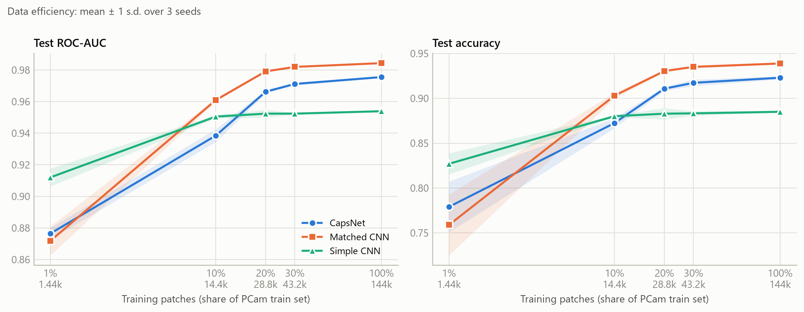
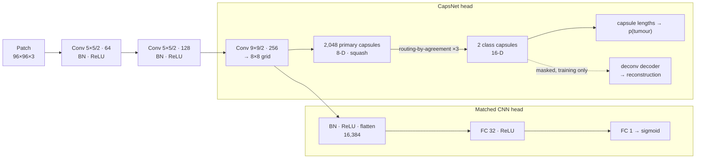
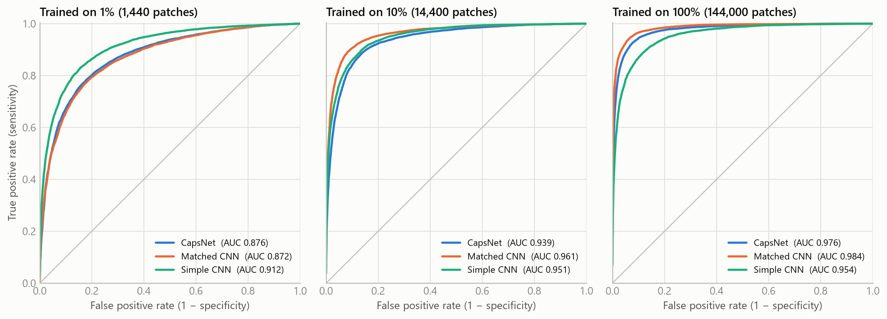
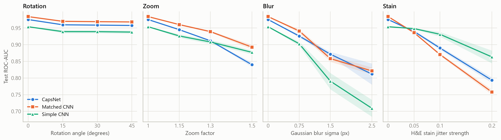
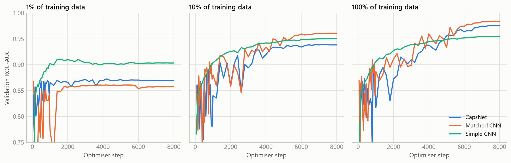
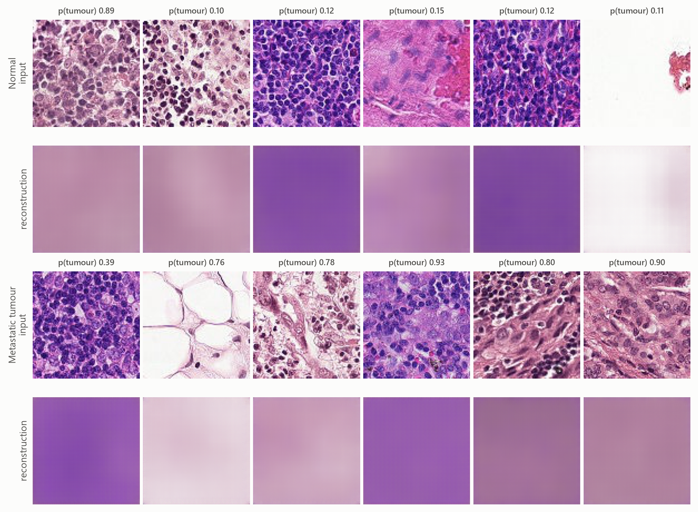

<div align="center">

# Capsule Networks vs. CNNs for Breast Cancer Metastasis Detection

**A controlled, reproducible comparison on PatchCamelyon (PCam) lymph node histopathology — in PyTorch**

[](https://github.com/vladnicodev/capsnet-breast-cancer-detection/actions/workflows/ci.yml)


[](https://github.com/astral-sh/ruff)
[](LICENSE)

</div>

Deciding whether breast cancer has spread to the lymph nodes is one of the most important factors in staging it, and pathologists make that call by searching gigapixel slides for small clusters of tumour cells. This project asks whether **capsule networks** (Sabour, Frosst & Hinton, 2017) live up to their two headline promises on that task: **better data efficiency** and **more robustness to viewpoint changes** than ordinary convolutional networks.

We train a dynamic-routing CapsNet and two CNN baselines on 1% to 100% of the 144,000 PCam training patches (3 seeds each, 63 runs including ablations). Every model is scored once on a held-out test set and then re-scored under rotation, zoom, blur and H&E stain shifts.

> **TL;DR.** The CapsNet is compared against a CNN with the *same* convolutional trunk and the *same* number of weights. The CNN wins at every training-set size from 10% of the data up, with a test ROC-AUC of **0.984 vs 0.976** on all data. It also trains **1.5× faster** and is more robust to changes of scale. Switching routing-by-agreement off changes nothing measurable. The capsule network's only advantage is under H&E stain shift.

<picture>
  <source media="(prefers-color-scheme: dark)" srcset="results/figures/data_efficiency_dark.png">
  
</picture>

**Key findings** (63 training runs; held-out test set; mean over 3 seeds)

- **No data-efficiency advantage.** At 1% of the data the CapsNet ties the matched CNN (0.876 vs 0.872 AUC). From 10% on it is behind at every size, by 0.022 AUC at 10%. Trained on all 144,000 patches, it still scores below the matched CNN trained on 20% of them.
- **Routing does no measurable work.** A single routing iteration, which gives uniform coupling, matches 3 iterations to within 0.001 AUC at 1%, 10% and 100% of the data.
- **No viewpoint robustness.** All models lose the same ~0.02 AUC under rotation. Under zoom the CapsNet degrades *most* (−0.136 AUC at 1.5×, against −0.092 for the matched CNN). It holds up better than the matched CNN only under stain shift (0.793 vs 0.758 AUC).
- **Capacity matters most when data is tiny.** With 1,440 training patches the 60k-parameter CNN beats both 3.4M-parameter models by 0.036–0.040 AUC, but it plateaus at 0.95 once more data is available.
- **Best model:** the matched CNN, with 0.984 ± 0.000 test ROC-AUC, 93.9% accuracy, 94.0% sensitivity and 93.8% specificity.

---

## Contents

- [Background](#background)
- [Research questions](#research-questions)
- [Dataset](#dataset)
- [Models](#models)
- [Experimental protocol](#experimental-protocol)
- [Results](#results)
- [Discussion and limitations](#discussion-and-limitations)
- [Reproducing the results](#reproducing-the-results)
- [Repository layout](#repository-layout)
- [Engineering notes](#engineering-notes)
- [Tech stack](#tech-stack)
- [Project history](#project-history)
- [Authors](#authors)
- [References](#references)

---

## Background

**The clinical problem.** Metastases in the sentinel lymph nodes decide the stage, and therefore the treatment, of breast cancer. Detecting them means scanning whole-slide images of H&E-stained tissue at high magnification. The work is slow and error-prone, and small metastases are easy to miss. The CAMELYON16 challenge showed that deep learning can match pathologists on this task [3]. PCam [2] turns the problem into a benchmark: classify a 96×96 px patch as containing tumour tissue or not.

**Why capsules?** A CNN detects features with convolutions and then discards *where* they are through pooling. That makes it translation-invariant, but it cannot represent spatial relationships between parts. A capsule outputs a **vector** instead of a scalar. The vector's length is the probability that an entity is present, and its orientation encodes the entity's pose. Higher-level capsules are activated by **routing-by-agreement**: lower-level capsules vote for their parents, and parents whose votes agree get stronger connections. The original paper argues that this makes capsules more data-efficient and better at generalising to new viewpoints. Histopathology is a natural test case. Diagnosis depends on how cells and nuclei are arranged, and tissue has no canonical orientation.

## Research questions

| | Question | How it is measured |
|---|---|---|
| **RQ1** | *Data efficiency*: do capsules need less labelled data? | Test ROC-AUC with 1%, 10%, 20%, 30% and 100% of the training set |
| **RQ2** | *Robustness*: do capsules generalise better to shifts not seen in training? | Test ROC-AUC under rotations by non-right angles, zoom, blur and H&E stain jitter |
| **RQ3** | *Cost*: what does routing cost in compute? | Training and inference throughput at equal parameter count |
| **RQ4** | *Ablation*: which parts of the CapsNet matter? | CapsNet without routing, and without the reconstruction decoder |

## Dataset

[**PatchCamelyon (PCam)**](https://github.com/basveeling/pcam) [2] contains 96×96 px RGB patches extracted from the 400 H&E-stained whole-slide images of sentinel lymph node sections in CAMELYON16 [3]. The slides were scanned at 40× and the patches are sampled at 10×. **A patch is positive if its centre 32×32 px region contains at least one pixel of metastatic tumour tissue.** This project uses the de-duplicated version distributed through the [Kaggle Histopathologic Cancer Detection](https://www.kaggle.com/c/histopathologic-cancer-detection) competition, arranged as a balanced 144,000 / 16,000 train/validation split:

| Split | Patches | Used for |
|---|---:|---|
| `train` | 144,000 (50% tumour) | training. Stratified subsets of 1–100%, nested per seed (the 10% subset ⊂ the 20% subset ⊂ …) |
| `valid`, first half | 8,000 (50% tumour) | checkpoint selection (validation ROC-AUC, 55 checks per run) |
| `valid`, second half | 8,000 (50% tumour) | **held-out test set**, evaluated once per run |
| `test` (unlabelled) | 57,458 | Kaggle submission via `capsnet_pcam.predict` |

## Models

All three models output a tumour probability for a 96×96×3 patch. The **matched CNN** is the key control. It shares the CapsNet's convolutional trunk layer for layer, and its fully connected head has exactly as many weights as the capsule layer (16,384 × 32 = 2,048 × 8 × 2 × 16 = 524,288). The only difference between the two models is therefore *capsules + routing* versus *a standard classifier head*, not network size.

| Model | Architecture | Parameters |
|---|---|---:|
| **Simple CNN** | Lightweight baseline from the project's first version: 3 × (conv 3×3 → ReLU → max-pool 4×4) → FC 64 → FC 1 | 60,545 |
| **Matched CNN** | Shared trunk → conv 9×9/2 (256) → BN → ReLU → flatten (16,384) → FC 32 → FC 1 | 3,389,057 |
| **CapsNet** | Shared trunk → 2,048 primary capsules (8-D) → 3 routing iterations → 2 class capsules (16-D); deconvolutional reconstruction decoder during training | 3,388,736 (+324,979 decoder) |



**Adapting CapsNet to 96×96 RGB patches.** On MNIST, the original CapsNet puts a 9×9 convolution and the 9×9/2 primary-capsule convolution directly on the 28×28 image, which gives 1,152 primary capsules. On a 96×96 patch the same design yields **51,200** primary capsules and a 28M-parameter fully connected decoder. This is what made the first, TensorFlow version of this project too expensive to train on the full dataset (see [Project history](#project-history)). Here, two strided 5×5 convolutions first reduce the patch to 24×24. That brings the count down to 2,048 capsules on an 8×8 grid, and a transposed-convolution decoder replaces the 28M-parameter FC decoder. Routing runs in float32 with gradients through the final iteration only (the other iterations only set the coupling coefficients), and the margin loss uses the paper's m⁺ = 0.9, m⁻ = 0.1, λ = 0.5.

## Experimental protocol

- **Identical training recipe for every model.** 8,000 optimiser steps of batch 128, AdamW (lr 1e-3, weight decay 1e-4), 250 warm-up steps followed by cosine decay, and bfloat16 autocast. A fixed *step* budget, rather than a fixed number of epochs, means small training sets are not also under-trained: 8,000 steps are ≈ 7 epochs of the full set and ≈ 711 epochs of the 1% subset.
- **Augmentation.** Each patch gets a random element of the dihedral group D4 (the 4 right-angle rotations × horizontal flip). These are exact symmetries of histology patches. Nothing else is used, so rotations by other angles, zoom, blur and stain changes stay *unseen* for RQ2.
- **Losses.** Binary cross-entropy for the CNNs. For CapsNet, margin loss plus 0.392 × pixel-wise MSE of the reconstruction; 0.392 is the reconstruction weight of the original Keras implementation.
- **Model selection and testing.** Validation ROC-AUC is computed every 50 steps for the first 1,000 steps, because models trained on small subsets peak early, and every 200 steps after that. The best checkpoint is kept. It is then evaluated **once** on the untouched 8,000-patch test half.
- **Seeds.** 3 seeds per configuration. The seed controls the training subset, weight initialisation, batch order and augmentation. Results are reported as mean ± standard deviation.
- **Threshold metrics.** Accuracy, sensitivity, specificity and F1 are computed at p = 0.5. For CapsNet this is equivalent to predicting the class with the longer capsule.
- **Hardware.** One NVIDIA RTX 5080 (16 GB), PyTorch 2.11, CUDA 12.8. Each run takes 1–2 minutes including evaluation.

## Results

All numbers are on the held-out 8,000-patch test split, as mean ± standard deviation over 3 seeds. Every table and figure is regenerated from the raw runs by `python -m capsnet_pcam.report`. Per-run results are in [`results/runs.csv`](results/runs.csv).

### RQ1: Data efficiency

The learning curves are in the figure at the top of this page.

| Model | 1% (1,440) | 10% (14,400) | 20% (28,800) | 30% (43,200) | 100% (144,000) |
|---|---:|---:|---:|---:|---:|
| CapsNet | 0.876 ± 0.004 | 0.939 ± 0.004 | 0.966 ± 0.001 | 0.971 ± 0.001 | 0.976 ± 0.001 |
| Matched CNN | 0.872 ± 0.009 | **0.961 ± 0.001** | **0.979 ± 0.000** | **0.982 ± 0.000** | **0.984 ± 0.000** |
| Simple CNN | **0.912 ± 0.006** | 0.951 ± 0.001 | 0.952 ± 0.002 | 0.952 ± 0.001 | 0.954 ± 0.001 |

*Test ROC-AUC. Bold marks the best model at each training-set size.*

- **The matched CNN beats the CapsNet at every training-set size from 10% up**, by 0.022 AUC at 10% and about 0.01 at 100%. Every one of these gaps is several times larger than the seed-to-seed spread. The gap is largest when data is scarce, which is the opposite of what the data-efficiency hypothesis predicts. The CapsNet trained on all 144,000 patches (0.976) still scores below the matched CNN trained on 20% of them (0.979).
- **At 1% (1,440 patches) the two are tied**, at 0.876 ± 0.004 vs 0.872 ± 0.009. Both 3.4M-parameter models overfit fast: 5 of their 6 best checkpoints come within the first 350 steps. The 60k-parameter simple CNN wins clearly (0.912). In this regime model capacity matters more than capsules vs. convolutions.
- **The simple CNN saturates at about 0.952 from 10% of the data onward**, so it is limited by capacity rather than data.

### Detailed metrics with all training data

| Model | ROC-AUC | Accuracy | Sensitivity | Specificity | F1 |
|---|---:|---:|---:|---:|---:|
| CapsNet | 0.976 ± 0.001 | 0.923 ± 0.002 | 0.914 ± 0.009 | 0.932 ± 0.006 | 0.922 ± 0.002 |
| Matched CNN | **0.984 ± 0.000** | **0.939 ± 0.001** | **0.940 ± 0.004** | **0.938 ± 0.005** | **0.939 ± 0.001** |
| Simple CNN | 0.954 ± 0.001 | 0.885 ± 0.001 | 0.880 ± 0.011 | 0.890 ± 0.009 | 0.884 ± 0.002 |

<picture>
  <source media="(prefers-color-scheme: dark)" srcset="results/figures/roc_curves_dark.png">
  
</picture>

### RQ2: Robustness to distribution shift

The models trained on all data are re-evaluated on the test set with each perturbation applied at increasing strength. None of these shifts were seen during training. The stain shift separates each patch into haematoxylin and eosin by colour deconvolution [5], then randomly rescales and offsets each stain, as in HED augmentation [4].

<picture>
  <source media="(prefers-color-scheme: dark)" srcset="results/figures/robustness_dark.png">
  
</picture>

| Model | Clean | Rotation 45° | Zoom 1.5× | Blur σ = 2.5 px | Stain jitter 0.2 |
|---|---:|---:|---:|---:|---:|
| CapsNet | 0.976 ± 0.001 | 0.958 ± 0.001 | 0.840 ± 0.007 | 0.812 ± 0.032 | 0.793 ± 0.008 |
| Matched CNN | **0.984 ± 0.000** | **0.968 ± 0.001** | **0.893 ± 0.007** | **0.821 ± 0.010** | 0.758 ± 0.008 |
| Simple CNN | 0.954 ± 0.001 | 0.938 ± 0.005 | 0.877 ± 0.006 | 0.709 ± 0.025 | **0.863 ± 0.019** |

*Test ROC-AUC under the strongest setting of each perturbation.*

- **Rotation.** Every model loses 0.014–0.016 AUC at 15° and at most 0.002 more up to 45°. Because the loss does not grow with the angle, it comes from the bilinear resampling, not from the new orientation. Training with 90° rotations and flips already makes all three models orientation-robust, and the CapsNet shows no extra benefit.
- **Zoom.** The CapsNet is the *least* robust model: −0.136 AUC at 1.5× magnification, against −0.092 for the matched CNN and −0.077 for the simple CNN. The viewpoint equivariance claimed for capsules does not extend to scale here.
- **Blur.** The two large models degrade about equally (0.812 vs 0.821 at σ = 2.5 px), with the CapsNet slightly ahead at σ = 1.5 px. The simple CNN collapses to 0.709.
- **Stain.** This is the CapsNet's one relative strength. It overtakes the matched CNN from the mildest jitter on and ends 0.035 AUC ahead at the strongest (0.793 vs 0.758). The small simple CNN is the most stain-robust model overall (0.863).

### RQ3: Computational cost

| Model | Parameters (inference) | + decoder (training only) | Training steps/s | Inference images/s |
|---|---:|---:|---:|---:|
| CapsNet | 3,388,736 | 324,979 | 123 | 78,976 |
| Matched CNN | 3,389,057 | – | 183 | 98,115 |
| Simple CNN | 60,545 | – | 237 | 119,581 |

*Measured on an RTX 5080 with bf16 autocast, training batch size 128 and inference batch size 512, with all training data.*

At the same parameter count, the matched CNN trains **1.5× faster** than the CapsNet, and the CapsNet runs inference **20% slower**. Removing the extra routing iterations or the decoder does not recover the speed: both ablations train at 110–123 steps/s. The overhead is in the capsule layer itself, which computes 2,048 × 2 sixteen-dimensional prediction vectors per patch in float32.

### RQ4: Ablations

| Variant | 1% | 10% | 100% |
|---|---:|---:|---:|
| CapsNet (3 routing iterations + decoder) | 0.876 ± 0.004 | 0.939 ± 0.004 | 0.976 ± 0.001 |
| CapsNet without routing (1 iteration) | 0.876 ± 0.001 | 0.938 ± 0.002 | 0.976 ± 0.000 |
| CapsNet without reconstruction decoder | 0.875 ± 0.009 | 0.936 ± 0.005 | 0.973 ± 0.002 |
| Matched CNN | 0.872 ± 0.009 | **0.961 ± 0.001** | **0.984 ± 0.000** |

*Test ROC-AUC.*

- **Routing-by-agreement contributes nothing measurable.** With one iteration the coupling coefficients stay uniform, and the capsule layer reduces to a learned linear vote followed by the squash non-linearity. It matches the full model to within 0.001 AUC at every data size.
- **The reconstruction decoder gives at most a marginal benefit.** Removing it costs about 0.003 AUC at 10% and 100%, which is within the seed spread at 10%. It makes no difference at 1%.
- **No variant closes the gap to the matched CNN.**

### Training dynamics

<picture>
  <source media="(prefers-color-scheme: dark)" srcset="results/figures/training_curves_dark.png">
  
</picture>

On 1% of the data, the matched CNN peaks within the first 100 steps and then overfits. The CapsNet peaks within 350 steps in two of three seeds. The simple CNN, with 56× fewer parameters, keeps improving until about step 1,600. With all data, every model reaches its best checkpoint in the last 1,000 steps of the schedule. The early validation curves of the two BatchNorm models are noisy, most likely because BatchNorm's running statistics lag behind the weights while the learning rate is high. The simple CNN has no BatchNorm, and its curve stays smooth.

<details>
<summary><b>What does the CapsNet reconstruct?</b> (click to expand)</summary>

<br>

<picture>
  <source media="(prefers-color-scheme: dark)" srcset="results/figures/reconstructions_dark.png">
  
</picture>

The reconstruction decoder only learns each patch's average stain colour, not its tissue structure. Two 16-D class capsules are too small a bottleneck to encode the texture of a 96×96 RGB patch. On MNIST digits the same regulariser works well. On histopathology, the reconstruction loss mainly pushes the capsules to encode colour.

</details>

## Discussion and limitations

**Why don't capsules help on this task?** The ablations point to an answer. If routing-by-agreement were extracting useful part–whole structure, switching it off would hurt, and it does not. Whether a PCam patch contains tumour is decided mostly by *local* cell appearance: nuclear size and shape, chromatin texture, cell density. Convolutions and pooling capture that well. Capsules are designed to model a spatial *configuration of parts*, and tissue in a 96×96 patch has no canonical configuration for them to model. The symmetries this data does have, rotations and reflections, are cheaper to obtain through augmentation, as done here, or through rotation-equivariant convolutions, which were designed for PCam [2]. The stain result fits the same picture. Squashing normalises capsule lengths, which may dampen global intensity shifts. The simple CNN is the most stain-robust of all, plausibly because its small capacity leaves it less able to exploit subtle colour cues.

**Practical takeaway.** On this task a well-matched CNN is more accurate, faster and at least as robust on 3 of the 4 shifts tested. Stain variation is better handled directly, through stain augmentation or normalisation [4], than by switching architecture.

**Limitations**

- *One capsule design.* Only dynamic routing [1] was tested, with a convolutional stem added for 96×96 inputs. Other routing schemes (EM routing, attention-based routing) or deeper capsule hierarchies may behave differently.
- *Shared, untuned recipe.* All models use the same optimiser, learning rate and 8,000-step budget. This is fair, but not optimal for each model: a separately tuned CapsNet might narrow the gap. With all data, the validation curves of both large models are still rising slightly when training ends.
- *Three seeds.* This is enough to resolve the gaps reported from 10% of the data on, since they are several times the seed spread. The 1% comparison between CapsNet and the matched CNN is a tie.
- *Patch-level, single-distribution evaluation.* The test split is half of the official PCam validation set. This version of the dataset does not guarantee that patches from the same whole-slide image stay within one split, so absolute scores may be optimistic. The *comparison* is unaffected, because every model sees the same split. The robustness tests use synthetic perturbations; a multi-centre dataset such as CAMELYON17 would be a stronger test. Clinical use would also need slide-level aggregation and lesion-level metrics.
- *Uncalibrated thresholds.* Accuracy, sensitivity and specificity use a fixed 0.5 threshold. ROC-AUC, the primary metric, does not depend on a threshold.

## Reproducing the results

**1. Install** (Python ≥ 3.10). Install the PyTorch build for your platform first ([pytorch.org](https://pytorch.org/get-started/locally/)). RTX 50-series (Blackwell) GPUs need a CUDA 12.8+ build.

```bash
git clone https://github.com/vladnicodev/capsnet-breast-cancer-detection.git
cd capsnet-breast-cancer-detection
python -m venv .venv && source .venv/bin/activate      # Windows: .venv\Scripts\activate
pip install torch --index-url https://download.pytorch.org/whl/cu128
pip install -e ".[dev]"
pytest -q                                              # 29 unit tests, CPU only, ~5 s
```

**2. Get the data.** Arrange the PCam patches in this folder layout (`train+val/train/{0,1}/*.jpg`, `train+val/valid/{0,1}/*.jpg`), then decode it once into NumPy arrays (~1.5 min, 4.4 GB):

```bash
python -m capsnet_pcam.prepare_data --src /path/to/pcam --out data/pcam
```

**3. Run everything**, or run the steps individually:

```bash
bash reproduce.sh /path/to/pcam     # full study: ~70 min on an RTX 5080
```

```bash
# a single run
python -m capsnet_pcam.train --model capsnet --fraction 0.1 --seed 0

# a grid; finished runs are skipped, so an interrupted sweep can simply be restarted
python -m capsnet_pcam.sweep --models capsnet matched_cnn --fractions 0.1 1.0 --seeds 0 1 2

# robustness to distribution shift, then all tables and figures
python -m capsnet_pcam.robustness --fractions 1.0
python -m capsnet_pcam.report

# Kaggle-format predictions for the unlabelled test set, with 8-way test-time augmentation
python -m capsnet_pcam.predict --run runs/capsnet/frac1/seed0 --images /path/to/test_images --out submission.csv --tta
```

Every training option is a command-line flag (`python -m capsnet_pcam.train --help`), e.g. `--routings`, `--recon-weight`, `--steps`, `--no-augment`, `--no-amp`. Each run writes `config.json`, `history.csv` (validation curve), `metrics.json`, `test_scores.npz` and `best.pt` to `runs/<model>/frac<f>/seed<s>/`.

## Repository layout

```
├── src/capsnet_pcam/
│   ├── models/
│   │   ├── capsules.py      # squash, primary capsules, dynamic routing, margin loss
│   │   ├── capsnet.py       # CapsNet + reconstruction decoder
│   │   └── cnn.py           # Simple CNN baseline and parameter-matched CNN
│   ├── data.py              # JPEG → .npy caching, stratified nested subsets, GPU batching, D4 augmentation
│   ├── perturbations.py     # rotation, zoom, blur and H&E stain shifts for robustness tests
│   ├── metrics.py           # ROC-AUC, accuracy, sensitivity, specificity, F1
│   ├── train.py             # training loop, checkpoint selection, evaluation   (CLI)
│   ├── sweep.py             # models × fractions × seeds grid, resumable        (CLI)
│   ├── robustness.py        # evaluation under distribution shift               (CLI)
│   ├── report.py            # aggregate runs → tables + light/dark figures      (CLI)
│   ├── predict.py           # Kaggle-format predictions with optional TTA       (CLI)
│   └── prepare_data.py      # one-off dataset caching                           (CLI)
├── tests/                   # pytest suite: capsule maths, models, data pipeline, metrics
├── results/                 # committed outputs: runs.csv, summary.csv/.md, robustness.csv, figures/
├── reproduce.sh             # the whole study end to end
└── .github/workflows/ci.yml # lint + tests on every push
```

## Engineering notes

- **The data pipeline is built for throughput.** The 160k JPEGs are decoded once, with 16 threads, into a uint8 array. Training keeps that array **on the GPU** (4.4 GB) and draws batches by indexing, and the random D4 augmentation also runs on the GPU. No `DataLoader` workers are needed and data loading costs almost nothing, so at batch 128 the CNNs train at 170–240 steps/s and the CapsNet at about 120.
- **Numerics.** Convolutions run in bfloat16 autocast on channels-last tensors. The capsule layers are kept in float32 as a precaution, because iterated softmax/squash updates can be sensitive to bf16 rounding.
- **The experiments are controlled.** The baseline is parameter-matched. Every model uses the same optimiser, schedule, step budget and augmentation. Subsets are nested and stratified, and model selection (validation) is separated from reporting (test).
- **Tested and linted.** 29 `pytest` tests cover the capsule maths (squash bounds and direction, coupling behaviour, gradient flow, margin loss), model interfaces, parameter matching, subset nesting and stratification, augmentation correctness, perturbations and the caching round trip. GitHub Actions runs `ruff` and the tests on Python 3.10 and 3.12.
- **Resumable and self-describing runs.** Every run stores its full config, learning curve, test scores and checkpoint. `report.py` regenerates every table and figure in this README from them.

## Tech stack

**Python** · **PyTorch** (CUDA, bf16 mixed precision, channels-last) · NumPy · pandas · scikit-learn · Matplotlib · Pillow · pytest · ruff · GitHub Actions

**Topics:** deep learning, computer vision, medical image analysis, computational pathology, capsule networks, convolutional neural networks, experimental design, ablation studies, robustness and distribution-shift evaluation, reproducible ML

## Project history

The first version of this project was written in TensorFlow/Keras, with the capsule layers adapted from [XifengGuo/CapsNet-Keras](https://github.com/XifengGuo/CapsNet-Keras). It compared a CapsNet with a small CNN on 10%, 20% and 30% of the data, because the unmodified CapsNet (51,200 primary capsules) was too slow to train on more.

The current version is a complete re-implementation in PyTorch. It adds:

- a CapsNet architecture that is tractable at 96×96 px;
- a parameter-matched CNN control;
- the full training set and a 1% regime;
- multiple seeds and a held-out test split;
- robustness and ablation studies;
- GPU-resident data loading, tests and CI.

## Authors

- **Vlad A. Nicolescu** ([@vladnicodev](https://github.com/vladnicodev))
- **Vlad Barbulescu** ([@vladaunski](https://github.com/vladaunski))
- **Andrei Pavel** ([@gunbreaker17](https://github.com/gunbreaker17))

## References

1. S. Sabour, N. Frosst, G. E. Hinton. [Dynamic Routing Between Capsules](https://arxiv.org/abs/1710.09829). *NeurIPS*, 2017.
2. B. S. Veeling, J. Linmans, J. Winkens, T. Cohen, M. Welling. [Rotation Equivariant CNNs for Digital Pathology](https://arxiv.org/abs/1806.03962). *MICCAI*, 2018.
3. B. Ehteshami Bejnordi et al. [Diagnostic Assessment of Deep Learning Algorithms for Detection of Lymph Node Metastases in Women With Breast Cancer](https://jamanetwork.com/journals/jama/fullarticle/2665774). *JAMA* 318(22), 2017.
4. D. Tellez et al. [Quantifying the effects of data augmentation and stain color normalization in convolutional neural networks for computational pathology](https://arxiv.org/abs/1902.06543). *Medical Image Analysis* 58, 2019.
5. A. C. Ruifrok, D. A. Johnston. Quantification of histochemical staining by color deconvolution. *Analytical and Quantitative Cytology and Histology* 23(4), 2001.

## License

[MIT](LICENSE). PCam is released by its authors under [CC0](https://github.com/basveeling/pcam). **This is research code. It is not a medical device and must not be used for clinical decisions.**
